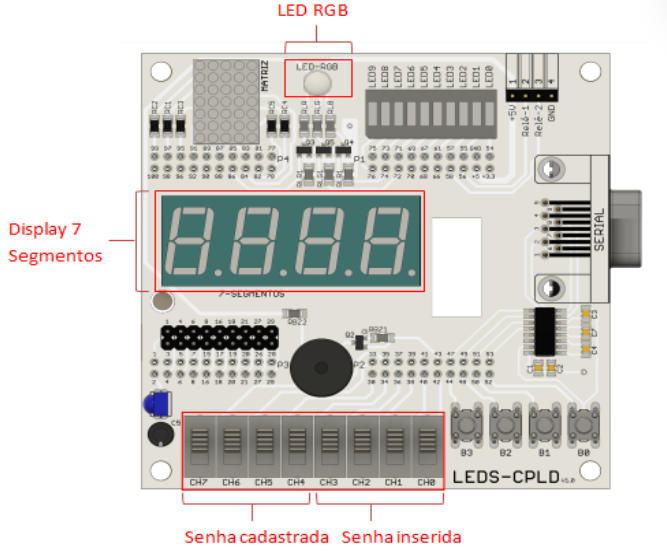
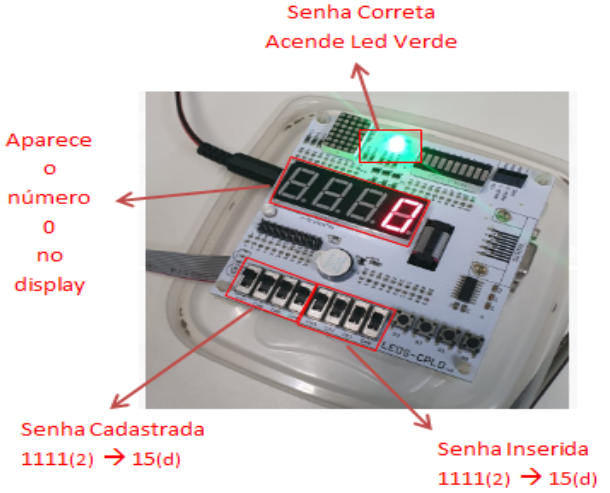
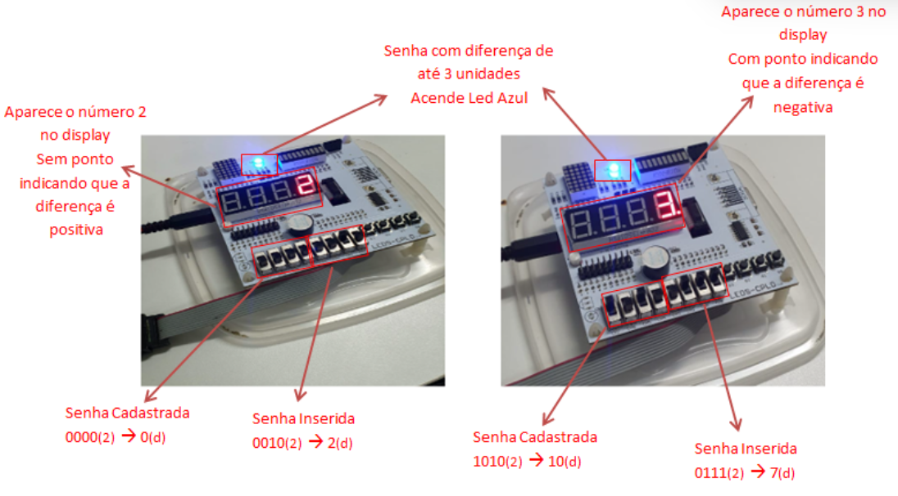
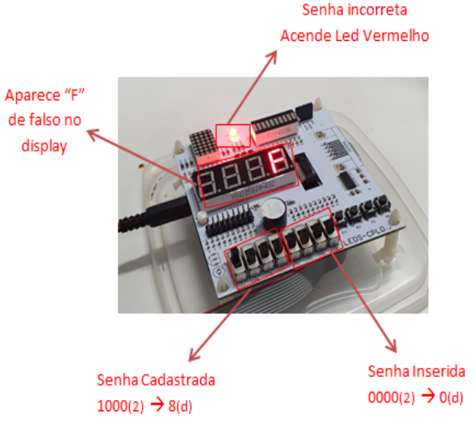

<h1 
    align="center"> 
    🔒 
      Sistema de Segurança Digital
</h1> 

# Descrição do Projeto

O Projeto demandado pelo componente curricular **TEC 498 MI - Projeto de Circuito Digitais**, utilizando 
    a metodologia Problem Based Learning (PBL). Nesse sentido, o sistema foi projetado a partir da linguagem
    de descrição verilog, possuindo o intuito de simular o sistema de Seguraça Digital. Essa simulação
    acontecerá no Kit LEDS-CPLD, utilizando, principalmente, os conceitos e conteúdos referentes à máquina de estado.

# **Requisitos de Projeto**

Dessa forma, o projeto descrito deverá receber uma senha de 0 a 15 que ao ser comparada com outra senha previamente cadastrada, também pelo usuário, deverá indicar os seguintes sinais mediante o cenário em que se encontra:

* Caso a senha seja igual, o cofre deverá ser aberto (uma sinalização luminosa é emitida);

* Se a senha inserida for maior ou menor que a senha cadastrada em até 3 unidades o cofre também é aberto (uma sinalização luminosa diferente da primeira é emitida);

* Se a senha for aceita, deverá ser exibido na tela o valor da diferença entre a senha cadastrada e a senha inserida, mostrando inclusive se essa diferença é positiva ou negativa;

* Caso a senha não seja aceita, deverá ser exibido uma mensagem de erro de forma legível e em uma interface humanamente amigável para o usuário.

# **Demonstração da Aplicação**

A interface de simulação é feita através do uso das chaves presentes no kit LEDS-CPLD. Em relação aos sinais 
de saída referentes a cada situação, por sua vez, são demonstrados através do LED RGB e do display de 7 segmentos também já incluídos na placa.

Funcionamento do protótipo para Sistema de Segurança Digital com as senhas iguais.

Funcionamento do protótipo para Sistema de Segurança Digital
com senhas de até 3 dígitos de diferença positivos e negativos.

Funcionamento do protótipo para Sistema de Segurança Digital
 com diferença superior a 3 (quando a senha é incorreta).

# **Tecnologias Utilizadas**

* Kit de desenvolvimento LEDS-CPLD, da família MAX II (modelo EPM240T100C5N);
* Linguagem de descrição de hardware Verilog;
* Projeto desenvolvido no ambiente Quartus II.

# **Pessoas Contribuidoras**

    Emanuel Antônio Lima Pereira
    Gabriel Sousa Sampaio
    Thiago Neri dos Santos Almeida

# **Referências**

    https://drive.google.com/file/d/132iacUp84EfLT1h1q_Fk5f3Js5hizhQA/view?usp=sharing

    Ronald J. Tocci, Neal S. Widmer, Gregory L. Moss. “Sistemas digitais : princípios e aplicações”; 
    revisão técnica Renato Giacomini; tradução Jorge Ritter. – 11ª edição – São Paulo : Pearson Prentice Hall, 2011;

    Ivan Valeije Idoeta, Francisco Gabriel Capuano. “Elementos de eletrônica digital”; – 40ª edição – São Paulo:Editora 
    Érica ltda. ,2008.

    